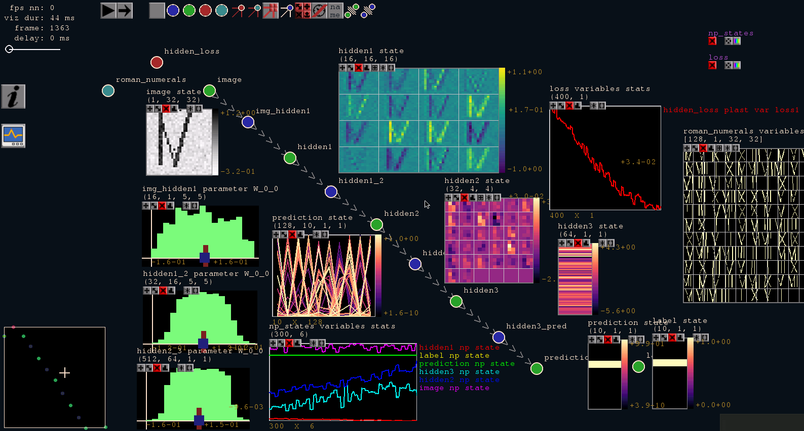

statestream
===========

Statestream is an experimental toolbox for [streaming](docs/from_one_frame_to_the_next.md) (synchronous layerwise-parallel) deep neural networks. 
It provides tools to easily design, train, visualize, and manipulate streaming deep neural networks.

This software is a research prototype and not ready for production use. It has neither been developed nor
tested for a specific use case. However, the license conditions of the
applicable Open Source licenses allow you to adapt the software to your needs.

**Because this toolbox currently is in trial / test phase, code APIs should not be expected to stay stable and 
continuous improvements will be made. Please make sure you always have the current version.**



------------------------------------------------------------------------------

[Documentation](docs/README.md)
---------------

[Troubleshooting](docs/troubleshooting.md)
-----------------

------------------------------------------------------------------------------

Some cornerstones
-----------------

* Emphasis on [streaming](docs/from_one_frame_to_the_next.md) data and networks.
* Emphasis on flexible and intuitive online visualization / manipulation of network states / parameters, etc.
* Qualitative not quantitative exploration of new network architectures (first 50 percent vs. last 2 percent performance).
* Emphasis on parallelism (processes, GPUs, restriced across machines).
* Suited for specific type of very large (numerous but small network modules/layers) recurrent neural networks.

Implementation:

* Networks are specified as yaml files.
* For now, statestream supports Theano (default) or Tensorflow as backend.

------------------------------------------------------------------------------

Differences to prominent DL-frameworks
--------------------------------------

The statestream toolbox does not aim to improve over existing tools with respect to memory or computation efficiency but rather enables investigation of streaming networks and interact with them during runtime. In fact, the statestream toolbox is much more memory / computation in-efficient than other existing tools.

* **streaming**: The network parts process information in a frame based / model-parallel synchronized manner, where one frame can be interpreted as one-step rollout of a recurrent neural network. Hence, dependent on network architecture, it may take several (up to many) frames until information is processed by the network. Now states stream through the network. 
* **separation of 'Layers'**: In contrast to most other deep learning toolkits, which decompose the network into layers, we try to emphasise the graph-nature of neural networks already in implementation. Hence, inside the statestream toolbox the network is decomposed in nodes (neuron-pools, short NP) and edges (synapse-pools, short SP). While NPs hold the state (a.k.a. feature maps) of the network, the SPs define the transformations between those states. For both, NPs and SPs, trainable parameters can be specified (e.g. bias for NPs, weights for SPs).
* **local updates**: Due to its streaming nature for execution, losses and more general everything that changes parameters (in statestream these
are called plasticities) are treated as separated parts of the network. While statestream also allows 'global' losses
covering the entire network, it emphasises on 'local' plasticities, which rely only on information from small parts of the network to determine updates for small subset of parameters. 

------------------------------------------------------------------------------

Pros
----

* (+) Enables streaming (consistently model-parallel) networks.
* (+) Intuitive behavior of recurrent neural networks (no extra rollout).
* (+) Shared memory representation enables online visualization and manipulation of network behavior.
* (+) Trivial parallelization across CPUs and GPUs due to model-parallelism.

Cons
----

* (-) Shared memory makes it harder to scale across machines.
* (-) Network representation in shared memory requires a considerable amount of memory and (parallel) inter-process communication.
* (-) For streaming (model-parallel) networks it is more challenging to specify adequate plasticities (losses).

------------------------------------------------------------------------------

Installation requirements
-------------------------

The statestream toolbox is tested with:

* [Ubuntu 16.04](https://www.ubuntu.com/)
* [Xfce](https://wiki.ubuntuusers.de/Xfce_Installation/) Desktop environment. Please see the [troubleshooting section](docs/troubleshooting.md) for color problems.
* [Python 3.5](https://www.python.org/) (but may also work with python 2.7 with little effort)

If one wants to use GPU support, it is assumed that [CUDA toolkit >=8.0](https://developer.nvidia.com/cuda-toolkit) and optionally [cuDNN >=5.0](https://developer.nvidia.com/cudnn) is installed.

Besides the requirements below, we strongly recomment using [anaconda](https://www.continuum.io/anaconda-overview) or [miniconda](https://conda.io/miniconda.html) to manage python packages and to set up a conda python environment, e.g.:

```
conda create --name statestream python=3.5
source activate statestream
```

The statestream toolbox requires the following python packages:

* [Python 3.5](https://www.python.org/)
* [NumPy >= 1.9.1 <= 1.12](http://www.numpy.org/): Basic mathematical tooling.
* [Pygame >= 1.9](http://www.pygame.org/): This is the main library used for online visualization.
* [ruamel_yaml](https://pypi.python.org/pypi/ruamel.yaml): This is used to specify network architectures.
* [SharedArray 2.0.2](https://pypi.python.org/pypi/SharedArray): This is used for inter-process communication.
* [h5py](http://www.h5py.org/): This library is used to store trained networks.
* [scikit-image](http://scikit-image.org/): This library is used for image handling.
* [Matplotlib](https://matplotlib.org/): Used to enhance visualization with Pygame.

To use the theano backend, the following packages are required:

* [Theano >= 0.9.0](http://deeplearning.net/software/theano/#): Please follow [these instructions](http://deeplearning.net/software/theano/install_ubuntu.html) for installation.
* [SciPy >= 0.14 <0.17.1](https://scipy.org/): This is a Theano requirement.
* [BLAS](https://en.wikipedia.org/wiki/Basic_Linear_Algebra_Subprograms): This is a Theano requirement.

To use the tensorflow backend, the following packages are required:

* [Tensorflow >= 1.4](https://www.tensorflow.org/): Please follow this [documentation](https://www.tensorflow.org/install/install_linux).

For the Theano backend, these requirements can be installed with:

```
conda install numpy scipy mkl theano pygpu scikit-image ruamel_yaml matplotlib h5py
pip install pygame sharedarray
```

Additionally, Tensorflow can be installed, e.g. through:

```
pip install --ignore-installed --upgrade https://storage.googleapis.com/tensorflow/linux/gpu/tensorflow_gpu-1.4.0-cp35-cp35m-linux_x86_64.whl
```

------------------------------------------------------------------------------

Installation
------------

* Check that all requirements are installed.
* Checkout the statestream repository.
* Compile some c/c++ functions:

```
cd statestream/ccpp
make
cd ..
```

* Add the path of the repository (the folder that also contains this README.md) to the PYTHONPATH environment variable, e.g. with:

```
export PYTHONPATH=$PYTHONPATH:/path to repository/
```

* Finally call the core once for initialization:

```
python core.py
```

Now the configuration file **~/.statestream/stcore.yml** was created and one can change the theano flag or the save folder parameter which specifies where for example models should be saved. In this folder also other log files are stored during runtime.

The demonstration example does not make use of GPU acceleration, but in order to use GPU support see the help on [devices](docs/devices.md).

------------------------------------------------------------------------------
    
Demonstration example
---------------------

A demonstration [example](examples/demo.st_graph) is provided with this repository for which neither an external dataset nor GPU support is required. It consists of a simple 4 layer network for classification of the first 10 roman numerals: I, II, III, IV, V, VI, VII, VIII, IX, X. Dependent on the monitor settings on the system, one may want to adapt the _screen_width_ and _screen_height_ setting in **~/.statestream/stviz.yml** (available after first launch of the visualization). The demonstration example in particular uses a resolution of 1600 x 900. The example can be started from the statestream folder with:


```
python core.py ../examples/demo.st_graph
```

In fact, this is the preferred way to start any statestream session. The statestream terminal starts and the last line in the console should look like the following (only with the current time):

```
Wed, 21 Dec 2016 12:53:41 @ initializing: (7 remaining) <<  <<
```

Now, the entire network specified in [demo.st_graph](examples/demo.st_graph) is instantiated in the background. Wait until the number of remaining items which are not yet instantiated reaches 0 and the network is ready (this can take some seconds), e.g.:

```
Wed, 21 Dec 2016 12:55:03 @ 00000000 <<  <<
```

While waiting, one can already start the provided GUI by entering **viz on** into the terminal and hitting enter:

```
Wed, 21 Dec 2016 12:53:50 @ initializing: (1 remaining) << viz on <<
```

The GUI opens and the network topology can be inspected. For this demonstration example, an example layout (graphview) of the network is provided. Once all items are instantiated, the network streaming can be started by pushing the play button in the GUI or entering **stream** into the terminal:

```
Wed, 21 Dec 2016 12:55:24 @ 00000000 << stream <<
```

In the visualization, one should see a similar overview to that at the top of this readme. The network is now streaming (the counter in the statestream terminal is the current frame), e.g.:

```
Wed, 21 Dec 2016 12:44:31 @ 00000732 << <<
```

To end the demonstration, enter **exit** in the statestream terminal.

Before running other provided examples, please set __visible_devices__ in **~/.statestream/stcore.yml** configuration file and read documentation on [devices](docs/devices.md). Also see the network [specification](docs/network_specification.md) and adapt especially paths and local devices specified in the **st_graph** example files. For more information on the statestream terminal and visualization, please visit the [documentation](docs/README.md). Good places to start further reading are:

* [Device handling](docs/devices.md)
* [Getting creative](docs/getting_creative.md)
* [Visualization tutorial](docs/visualization.md)
* [Network specification](docs/network_specification.md)

An example realizing the common training / validation / test session is also provided: [st_graph file](examples/test_core_client_trainvaltest.st_graph), [client file](examples/core_clients/trainvaltest.py).

------------------------------------------------------------------------------

Contributing
------------

Please see also [CONTRIBUTING](CONTRIBUTING.md).

------------------------------------------------------------------------------

License
-------

The statestream toolbox is open-sourced under the Apache-2.0 license. See the
[LICENSE](LICENSE) file for details.

For a list of other open source components included in the statestream toolbox, see the file [3rd-party-licenses.txt](3rd-party-licenses.txt).

