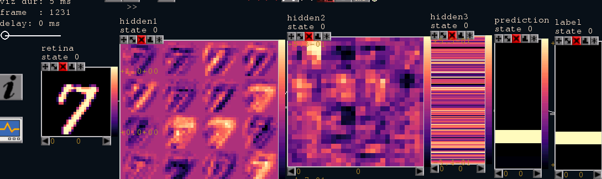

From one frame to the next
==========================
([back to documentation](README.md))

The statestream toolbox distributes a specified network in a synchronous layerwise-parallel fashion
across GPUs and CPUs. The network's elements (items: neuron-pools, synapse-pools, plasticities and
interfaces) are executed in parallel synchronized in frames, which are composed of a read and a write phase.
All processes work on a shared representation of the entire network.

An example animation to illuminate the streaming aspect is given below. Here we see a short sequence of frames. 
The single images show the ascending feature maps (from left to right) for three hidden representations 
(2 with spatial and the last without spatial information). We see that for this
simple forward network, information travels from the input (most left) to the prediction (most right) from one frame to the next.

