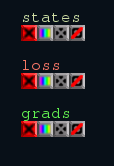
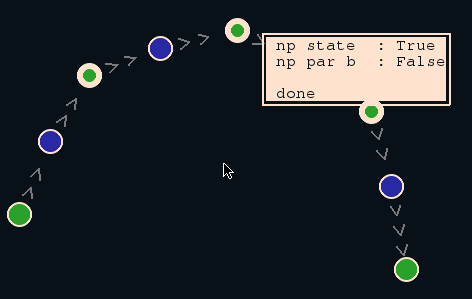
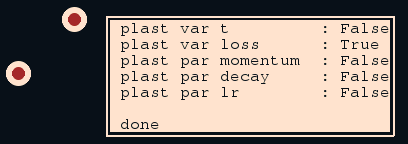
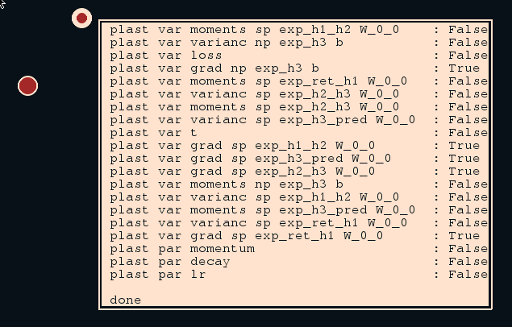
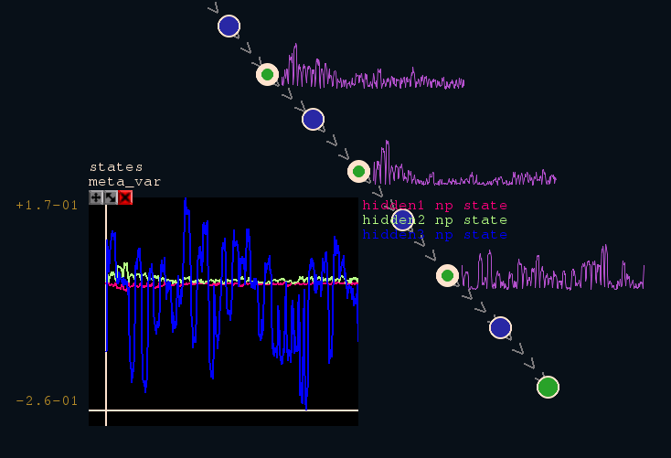
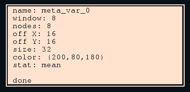

Meta-variables
==============
([back to documentation](README.md))

Meta-variables are a concept of aggregating information about a subset
of items (namely all selected) and visualizing this information in a
suitable way.

As stated earlier meta-variables can be created by a RMB click on 
a selected item. Now all available meta-variable types for this kind of
selection will be shown and one can be selected with an LMB click.
For now only one type the scalar_stats is provided.

After selecting the desired meta-variable type, one can specify parameters
provided for this type of meta-variable.

A list of all currently available instances of meta-variables is shown
on the right side of the screen. Hovering over a meta-variables name 
in this list will show some details in the bottom left corner as well as
drawing a circle arround all its child items. An LMB click on the name
will change the selection to all child items of the meta-variable. An
RMB click on the name will destroy this current meta-variable and re-open
the parameter specification with the parameters from the meta-variable
allowing quick parameter changes.

Below a list of available meta-variable types. The process of creating a
meta-variable is only described once in detail for the _scalar_stats_
meta-variable and is similar for the rest.

scalar_stats
------------

This type of meta-variable provides a visualization of scalar measures
for any network states, parameters, variables, etc. For a list of available measures 
please see the method **array_property()** in [utils/properties.py](../statestream/utils/properties.py).

It is also possible to show scalar measures for several (over different items and/or different e.g. parameters)
states, parameters, variables, etc.

After the scalar_stats meta-variable type was selected, all states, parameters, variables, etc. are determined
which are available for each of the selected items and a listing of those will be given. From this listing an
arbitrary sublist can be selected. All selections will now be visualized.

Some examples:

* A subset of neuron-pools was selected and one wants to visualize a scalar statistics of the neuron-pool's states:

* A subset of plasticities was selected and one wants to visualize the losses of the plasticities:

* A single plasticity is selected and one wants to visualize a scalar statistic for each gradient:

After this selection, one may specify parameters for the meta-variable, such as its name. See the list
of parameters below.

Every scalar_stats meta-variable provides an aggregated visualization of all its scalar statistics.
In the case more then one single item but only one state, parameter, variable, etc. was selected, the
meta-variable is **itemable**, which means that the scalar statistics can be visualized at the items.
The following figure gives an illustration of the itemized and aggregated visualization of a meta-variable:

Parameters:

* **name** (str): This parameter specifies the name of the meta-variable.
* **nodes** (int): The number of temporal nodes (steps) used to visualize (memorize)
the meta-variable. For each node, the mean value over 'window' number of
frames is computed, stored and visualized.
* **window** (int): The window over which the mean is taken for a single step (node). Hence,
this measure can be visualized for **window** x **nodes** neuronal frames into the past, where
this entire intervall will be compressed into **node** steps.
* **off_X**, **off_Y** (both int): If the meta-variable is itemable, this defines the relative offset in pixels to the meta-variable's item.
* **color** (int, int, int): Color in which to show the meta-variable on the screen.
* **size** (int): The size in pixel, the measure is drawn on the screen in the itemable mode. This parameter is only necessary for itemable meta-variables.
* **stat** (str): One of the available measures from [array_property()](../statestream/utils/properties.py).

scalar_three_stats
------------------

Similar to the scalar statistics meta-variable, with the _scalar_three_stats_ meta-variable it is possible to track 2(3) statistics, e.g. mean and variance together. For selection, the _scalar_stats_ meta-variable is available, the _scalar_three_stats_ is also. This meta-variable is best viewed in the _scatter_ viewing mode:

bivariate_metric
----------------

This meta-variable computes a metric between two tensors along the 2. dimension. The result is always a matrix whose coefficient m_ij holds the metric between A_i and B_j, where A_i = B[:,i,:,:] and B[j] = B[:,j,:,:]. For example A and B may be neuron-pool states.

Available metrics are:

* L0, L1, L2: The corresponding distance between the two sub-tensors.
* cos: The cosine-distance between the two sub-tensors.
* dot: The dot-product between the two sub-tensors.
