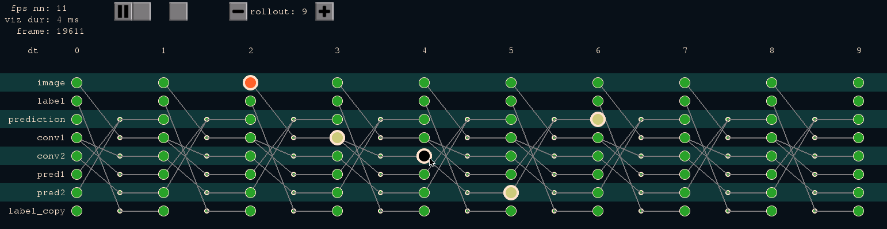

The Rollout-View
================
([back to documentation](README.md))

Besides the main visualization, a rollout view of the network graph can be shown during runtime to better understand the network's temporal behavior.
The rollout view lists all neuron-pools and enrolles the network for a specifyable depth into the future. No meta-variables or sub-windows are available in rollout view.

The rollout view shows the network graph over time as a matrix, where each row is a specific NP and each column is a certain time frame. Synapse-pools are visualized as connections between NPs rolled-out over time. 

Some features are provided:

* The rollout view can be started using the statestream terminal using the **rv on** command or in a stand-alone fashion, e.g. calling:

```
python visualization/rollout_view.py ../examples/mnist_small.py
```

* In case the rollout view is called in the statestream terminal with an instantiated network, neuron-pool states can be visualized with an LMB click on a NPs name (compare image below). The number of visualized past frames can be changed by LMB click on the arrow buttons for the _memory_.

* The network rollout can be scrolled up or down by holding down the RMB and dragging the screen.

* Hovering the mouse over a NP will show all past and future NPs that influenced or will be influenced by this neuron-pool. Orange colored NPs indicate that this neuron-pool's state is invalid because it is from the future (compare image below).

* Each plasticity is represented by a red circle on the top right screen corner. A single plasticity can be selected with a LMB click and the rolled out network parts for loss computation are highlighted for this plasticity (compare image below).

* Two adjacent NPs can swap positions in the list by a LMB click on the according empty button at the very left screen corner.

* The temporal offset _dt_, used in the rollout view, can be changed by LMB clicks on the arrow buttons.

* The number of rolled-out frames can be specified by LMB clicks on the arrow buttons.

* The ESC key will end the rollout view.



