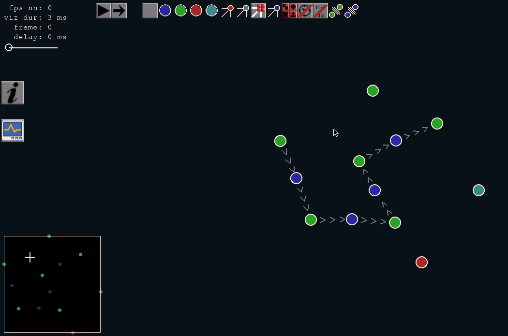
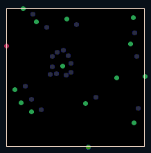
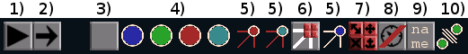
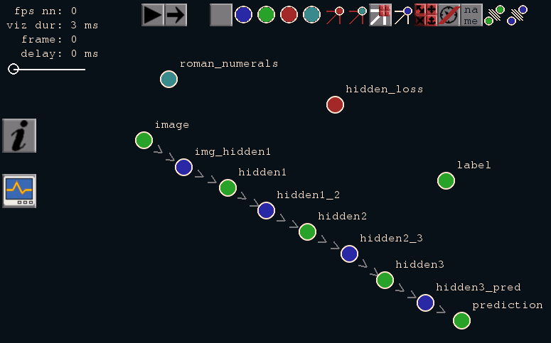
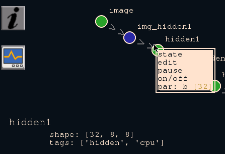
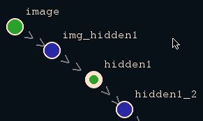
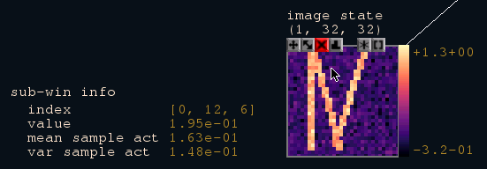
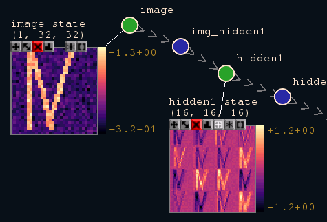
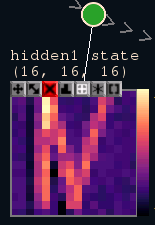
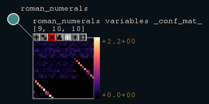

Visualization
=============
([back to documentation](README.md))

For this brief tutorial we used the [demo.st_graph](../examples/demo.st_graph) example.

The statestream repository contains a ready to use visualization tool.
Because all processes work on a shared representation of the network, it 
is relatively easy to add other more specialized visualization tools.

The main user interface has the form of a graph representation of the
network. When starting the visualization for the _demo_ example
one should see something similar to figure **Visualization**.

&nbsp;

**Figure: Visualization**

&nbsp;

When the coloring seems wrong, please see the 
[trouble shouting](troubleshooting.md) section.

If the visualization is started the first time for a network, all
items are placed randomly. When closing the visualization, the
item positioning will be stored in ~/.statestream/viz and will be
used when working with the same network (same means same name)
again. It is possible to save/load multiple different layouts
with [r/w-shortcuts](hotkeys.md).

A double rotating yellow circle in the top right corner of the 
screen, as shown below, indicates that the network is still being
initialized. If these circles are gone, the network is ready to 
start streaming.

&nbsp;

**Figure: Network initializing**

&nbsp;

At the very top left corner of the screen some timing information
is shown:
* **fps nn**: Number of frames per second the entire network streams.
* **viz dur**: Number of milliseconds one cycle of the visualization
consumes (this is parallel like all other processes but asynchrone
unlike all other processes).
* **frame**: The overall frame counter of the neuronal network.
* **delay**: Adjustable delay in milliseconds for each neuronal frame.
This can be used to slow down network streaming, e.g. for visualization
purposes. 

A minimap of all items is drawn in the lower left corner as shown in 
the figure below.

&nbsp;

**Figure: Minimap**

&nbsp;

Figure **Top buttons** shows the top row of buttons for the visualization:

1) **stream/pause**: The first button alternates between the streaming and 
paused mode of the network. It has the same effect as executing **stream** 
or **pause** in the statestream terminal.
2) **one-step**: When in pause mode one can execute a single step by pressing 
this button.
3) **debug**: For now this button shows some debug information.
4) **hide/show item**: These four buttons hide / show all items this type.
5) **hide/show connections**: With these three buttons, connections of item 
types can be hidden / shown.
6) **hide/show sub-window connections**: This button hides / shows the 
connections between items and all their sub-windows.
7) **close sub-window**: This button closes all sub-windows.
8) **profiling**: This button alternates between three different modes for 
showing profiling information:
	* Show no profiling information at all.
	* Show profiling information for all items (R/W numbers indicate the 
	number of milliseconds this process consumes 
	during Read / Write phases)
	* Show profiling information only for selected items.
9) **item name show/hide**: This button provides the same functionaly as 8) 
but for item names:
	* Show item name only when mouse over.
	* Show all item names.
	* Show names for all selected items.
10) **np force on/off**: This button disables/enables the repulsive forces 
between neuron pool items.

&nbsp;

**Figure: Top buttons**

&nbsp;

Try to hide certain connections and to arrange all items in a way that
 gives a suitable overview (compare figure **Item arrangement**). 

&nbsp;

**Figure: Item arrangement**

&nbsp;

Each item of the network graph is represented as a colored circle. 
The color indicates the item's type:

* **green**: neuron-pool
* **blue**: synapse-pool
* **red**: plasticity
* **cyan**: interface

Moving the mouse over an item will give some information 
about the item in the lower left screen corner (see figure 
**Item information**). This is
mostly the specification of the item from the st_graph file.
A click with the right mouse button on an item will open a
list of available options for this item (see also figure 
**Item information**).

&nbsp;

**Figure: Item information** (lower left corner) 
and sub-window options (bright window at item).

&nbsp;

Every item can be moved by simply dragging it with the left mouse button
(Try to drag one neuron-pool next to another and see what happens).
Items can also be selected with a single LMB click and additional items
may be selected holding the shift key. All selected items have a broader border
circle (see figure **Item selection**). All selected items can be un-selected by a single
LMB click on an empty part of the screen.

&nbsp;

**Figure: Item selection**

&nbsp;

Besides the network graph, one can open **sub-windows** (see further below) through RMB-click on 
a not-selected item, or define [meta-variables](meta_variables.md) through RMB-click
on selected items to visualize item parameters, variables, states, etc.

Please see also the [shortcut overview](hotkeys.md).

A single LMB or RMB click on an item has different effects,
depending on whether the item is selected:

* un-selected: Opens a list of diffent effects / options for
the clicked item (compare figure **Item arrangement**). 
The item circle has a narrow bright border. 
* selected: Opens a list of all available meta variables for
this layout of selected items. The item circle has a broad 
bright border.

For more details on the concept of meta-variables please see
the [documentation](meta_variables.md).

**Note:** The available sub-windows only show for non-selected
items.

Available options depend on the item type and specific
item clicked. An option can be selected by a LMB click.
Most options are self-explanatory and will 
show different parameters / variables of the clicked item.
For example, scalar parameters can be easily changed 
by entering a new value into the opening window.

For example: If a non-selected neuron-pool was RMB-clicked 
a list of available options will be shown as in figure
**Item information**. All
neuron-pools have the option _state_ which will show a
visualization of the current neuron-pool state.

Most of the available options will open a small sub-window 
that displays the chosen option.
For an example see figure **Item options** where we selected 
the 'state'
option for the _image_ neuron-pool of the demonstration 
example (if no numeral is visible one may have not hit 
the stream button yet). 

&nbsp;

**Figure: Item options**

&nbsp;

Sub-windows have seven small buttons at their top left corner
(see figure **Sub-window buttons**), which enable (from left to right):

* dragging the sub-window: Click and drag will drag the sub-window.
* scaling the sub-window: Click and drag will scale the sub-window.
* closing the sub-window: Click will close the sub-window.
* switching between visualization styles / modes. Available modes for now are:
	* _maps_: Will show the data as images.
	* _hist_: Will show a histogram of the data.
	* _RGB_: If the first or second data dimension equals three it can be visualized as an RGB image.
	* _plot_: Show the data as curve-plots.
	* _scatter_: Show the data as a scatter plot, if one of the first two data dimensions equals 2 or 3.
* show/hide tiles: Click will show/hide tiles for map or RGB view.
* change the magic function: Click will open a window where the magic function can be changed. The magic function is a string specifying a function that is evaluated before the visualization of the data. The data is referenced inside the string using the hash '#' sign, for example: np.mean(#, axis=1). The magic function may change data dimensions. By default the magic function is an empty string which represents the identity function.
* change the array access pattern: Click will open a window where the data access pattern can be changed. 

&nbsp;

**Figure: Sub-window buttons**

&nbsp;

In _maps_ view mode, the color-map of the sub-window can be changed by 
an LMB click on the colormat at the right of the sub-window.

Moving the mouse over areas of the image view will (if possible)
show some detailed information in the lower left corner.
figure **Mouse over** shows an example where we get some 
information about
the 'neuron' the mouse hovers currently over, such as its
index in the feature maps and its activation.

&nbsp;

**Figure: Mouse over**

&nbsp;

In cases several feature maps are shown (see figure
**Feature maps**) an LMB click
on a specific feature map will only show this
feature map (see figure **Single feature map**). 
Another click will switch back.

&nbsp;

**Figure: Feature maps**

&nbsp;

**Figure: Single feature map**

&nbsp;

To see now if the network has learned to classify the roman numerals,
one way is simply to contrast the neuron pool states for ground-truth 
and network prediction as shown in figure **Ground-truth vs
prediction** while streaming or with one-steps.
Notice the delay between the two caused by the network topology.

&nbsp;

**Figure: Ground-truth vs prediction**

&nbsp;

A more sophisticated way of evaluating the performance is the
temporal confusion matrix which is provided as a variable by
the _roman numerals_ interface (see figure **Temporal confusion matrix**). 
For different delays between stimulus onset
of roman numeral and classification results, a confusion matrix
is computed. Here in figure **Meta-variable** nine confusion 
matrices are computed
and we see that the classification result is at chance level for the first
5 frames (1 is caused by the interface and 4 by the network's topology) after
a stimulus onset but when at frame 5 (counting the first confusion matrix
as frame 0), we see an acceptable confusion matrix.
This is the first frame at which information from the image reaches
the prediction.

&nbsp;

**Figure: Temporal confusion matrix**

&nbsp;

